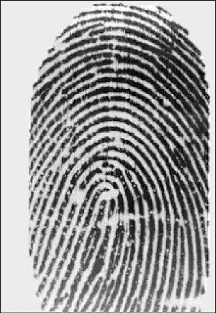
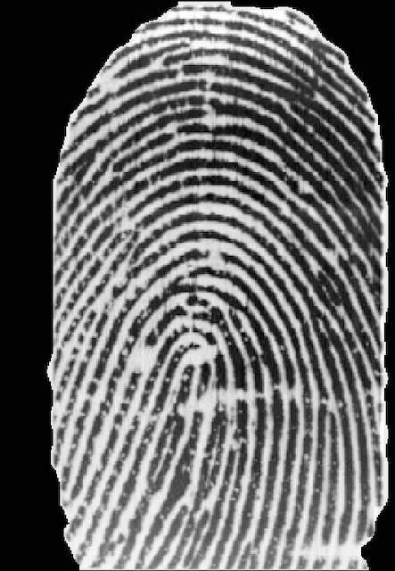
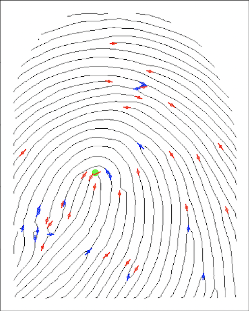

# pyfnprint fingerprint recognition library

## Disclaimer
This is a simple fingerprint recognition library written in Python3. The library implements various fingerprint preprocessing and recognition methods along with evaluation and database splitting utilities. The library is focused on classical image-processing-based approach and does not use more advanced machine learning techniques such as neural networks.

The library is created out of purely academic and research-related goals and does no focus on efficiency and/or is not created to be used in production.

## References
(Almost) all references that have been used to write the library are located in the [references](references) directory

## TLDR

### Prepare environment (assuming ${PWD} is the root of the repository)
```bash
python3 -m venv .venv
source .venv/bin/activate
python3 -m pip install -r requirements.txt
export PYTHONPATH=$PYTHONPATH:$PWD
```

### Split [db](db) files into a random train/test parts
```bash
python3 scripts/dbsplit.py -f 75 -i 75 db/PNG data
```

### Enroll train data
```bash
python3 example/example.py -e data data/templates
```

### Identify test data
```bash
python3 example/example.py -p data data/templates
```

### Evaluate the predictions
```bash
python3 scripts/evaluation.py data/test.csv data/prediction.csv
```

## Directory tree structure

### [src/fplib](src/fplib) - the main library sources
- [image.py](src/fplib/image.py) - wrapper type for a fingerprint image with a filename formatted like `{id}_{number}.{extension}` and lazy reading
- [preprocess.py](src/fplib/preprocess.py) - preprocessing with various image quality enhancing functions and functions for extraction of ridge characteristics
- [binarize.py](src/fplib/binarize.py) - binarization and various `opencv` wrappers
- [filter.py](src/fplib/filter.py) - filters with support of custom kernels and gabor filtering
- [minutae.py](src/fplib/minutae.py) - extraction of minutae points and core point detection
- [feature.py](src/fplib/feature.py) - feature extraction and comparison
- [plot.py](src/fplib/plot.py) - plotting module for various stages of preprocessing

### [db/PNG](db/PNG) - toy database
- A tiny database that contains 128 high quality fingerprint images - 8 for each user. Images are labeled as `{id}_{number}.png` where `id` is the identifier of a finger and `number` is the identifier of a specific fingerprint image of the finger
- More challenging database can be found for example at the [FVC](https://en.wikipedia.org/wiki/Fingerprint_Verification_Competition) competition

### [src](src) - command line utilities
- [scripts/dbsplit.py](scripts/dbsplit.py) - сommand line tool for splitting any amount of fingerprint images into a single filesystem database with train/test structure
- [scripts/evaluation.py](scripts/evaluation.py) - сommand line tool for evaluating predictions

### [example](example)
- [example/example.py](example/example.py) - an example program that uses fplib sources to create a fingerprint identification model

**Original image**                    | **Skeletonized**
:------------------------------------:|:------------------------------:
             | 
**Original image**                    | **Segmented**
             | 
**Ridge orientations**                | **Minutae**
 | 
